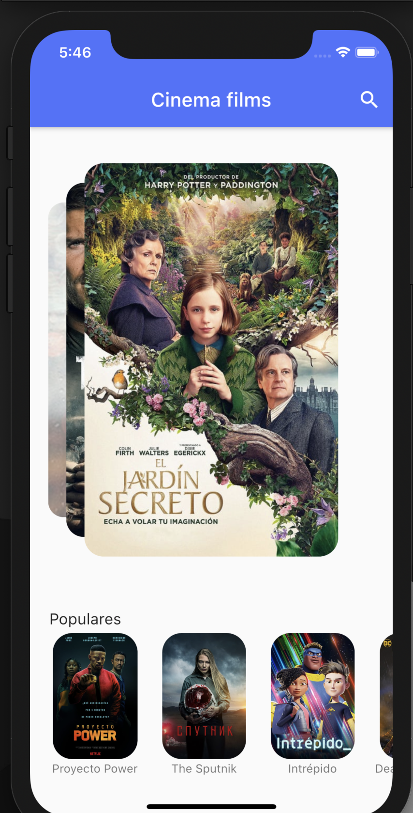
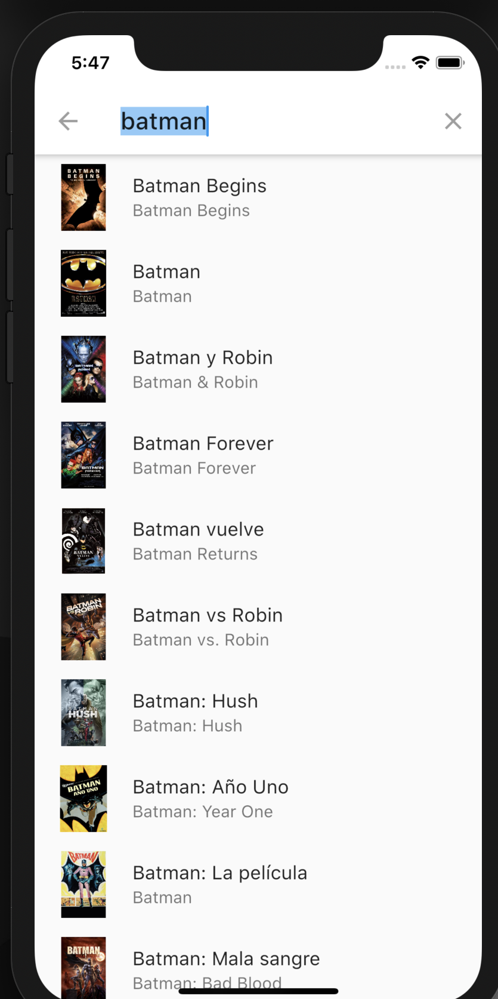

# films_app

Flutter app project for showing current films on cinemas.
<div style="text-align: center">

</img>
</img>
</img></div>


## Movies API

It was used the following API for getting all the udpated movies information:
[TMDB](https://www.themoviedb.org/)

## To run the application in the mobile simulator (IOS or Android)

```terminal
flutter run
```

## Flutter documentation

[online documentation](https://flutter.dev/docs)
